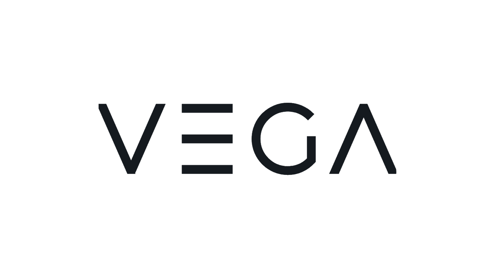

# Vega Portfolio Dashboard

A responsive React/TypeScript application for tracking and visualizing investment portfolio data. This application features interactive charts, dark/light mode, responsive design, and a mock API server for development.



## 📋 Table of Contents

- [Getting Started](#getting-started)
  - [Prerequisites](#prerequisites)
  - [Installation](#installation)
- [Development](#development)
  - [Running the App](#running-the-app)
  - [Mock API Server](#mock-api-server)
  - [Available Scripts](#available-scripts)
- [Testing](#testing)
  - [Running Tests](#running-tests)
  - [Test Structure](#test-structure)
  - [Mock Data](#mock-data)
- [Project Structure](#project-structure)
- [Key Features](#key-features)
- [Technologies Used](#technologies-used)

## 🚀 Getting Started

### Prerequisites

Before you begin, make sure you have the following installed on your machine:

- Node.js (v14 or higher)
- npm (v6 or higher) or yarn

You can check your versions by running:

```bash
node -v
npm -v
```

### Installation

1. Clone the repository:

```bash
git clone https://github.com/yourusername/vega-task.git
cd vega-task
```

2. Install dependencies:

```bash
npm install
# or if you use yarn
yarn install
```

## 💻 Development

### Running the App

To start the development server:

```bash
npm start
```

This will launch the app at [http://localhost:3000](http://localhost:3000).

### Mock API Server

This project uses a mock API server to simulate backend data. To start the mock server:

```bash
npm run start:server
```

The mock server will run at [http://localhost:3001](http://localhost:3001) and provides the following endpoints:

- `GET /assets` - Returns a list of investment assets
- `GET /portfolio` - Returns the user's portfolio data
- `GET /prices?timeRange=1D|1W|1M|1Y` - Returns price history data for the specified time range

Mock data is stored in the `server/data` directory. You can modify these files to change the mock responses.

### Available Scripts

- `npm start` - Starts the development server
- `npm run start:server` - Starts the mock API server
- `npm run build` - Creates a production build
- `npm test` - Runs tests in watch mode
- `npm run test:coverage` - Runs tests with coverage report

## 🧪 Testing

### Running Tests

To run all tests:

```bash
npm test
```

To run a specific test file:

```bash
npm test -- src/dashboard/dashboard.test.tsx
```

To generate a coverage report:

```bash
npm run test:coverage
```

### Test Structure

Tests are organized alongside their respective components. For example:

```
src/
  components/
    chart-card/
      chart-card.tsx
      chart-card.test.tsx
  dashboard/
    dashboard.tsx
    dashboard.test.tsx
```

### Mock Data

Tests use Jest mocks to simulate API responses and component behavior:

- API service mocks are defined in test files using `jest.mock()`
- Child components are mocked to simplify testing and focus on the component under test
- Test data is defined in the test files to match the expected API response formats

Example of mocking a service:

```typescript
jest.mock("../services/api.service", () => {
  return {
    __esModule: true,
    getAssets: jest.fn(),
    getPortfolio: jest.fn(),
    getPrices: jest.fn(),
  };
});
```

Example of mocking a child component:

```typescript
jest.mock("./line-chart/line-chart", () => {
  return {
    __esModule: true,
    LineChart: () => <div data-testid="mock-line-chart">Line Chart</div>,
  };
});
```

## 📁 Project Structure

```
src/
  components/         # Reusable UI components
  context/            # React context providers
  dashboard/          # Dashboard feature components
  home/               # Home page components
  img/                # Image assets
  main/               # Main layout components
  services/           # API and utility services
  App.tsx             # Main application component
  index.tsx           # Application entry point
  theme.scss          # Global theme variables
server/
  data/               # Mock API data files
  server.js           # Mock API server
```

## ✨ Key Features

- **Interactive Dashboard**: Portfolio overview with charts and tables
- **Responsive Design**: Works on desktop and mobile devices
- **Dark/Light Mode**: Theme toggle with persistent user preference
- **Time Range Filtering**: View data across different time periods
- **Asset Allocation**: Visual breakdown of portfolio composition
- **Performance Tracking**: Line chart showing portfolio value over time

## 🛠️ Technologies Used

- **React**: UI library
- **TypeScript**: Type safety and developer experience
- **Chart.js**: Data visualization
- **SCSS**: Styling with variables and nesting
- **Jest & React Testing Library**: Testing framework
- **Express**: Mock API server

---
